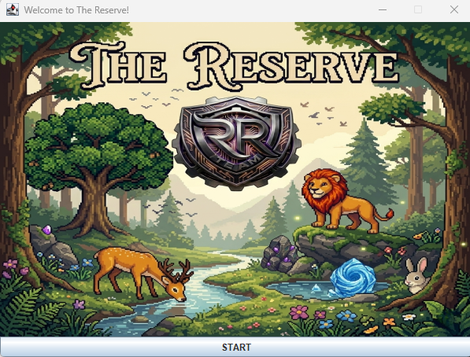
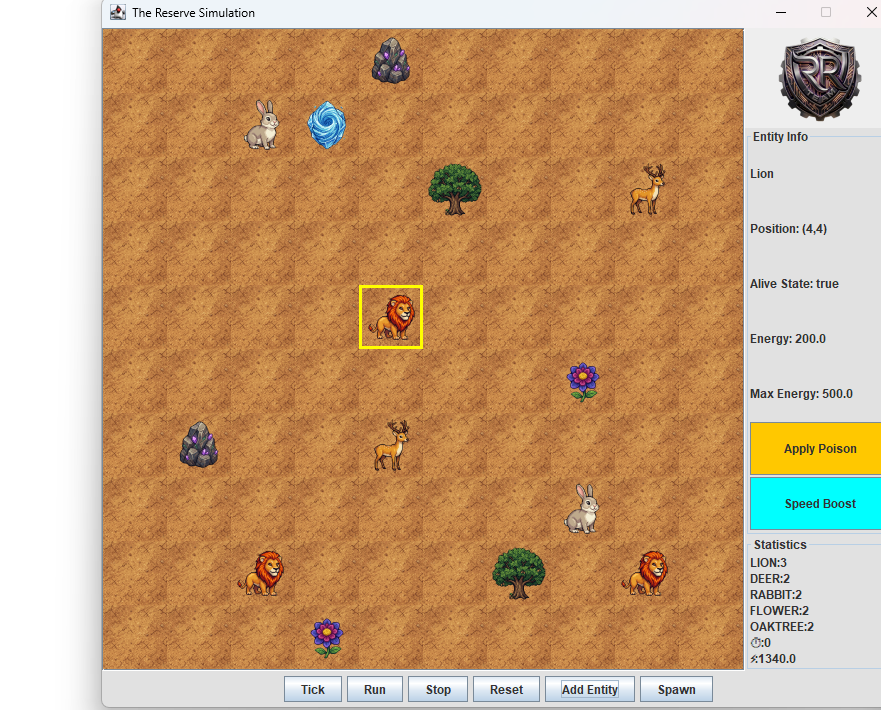
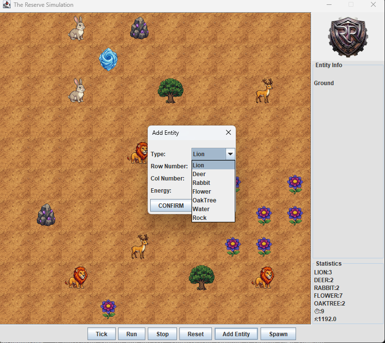

# 🌿 The Reserve: Ecological Simulation

A multithreaded, network-enabled ecological simulation built in **Java (Swing)**, modeling predator-prey dynamics, plant growth, dynamic status effects, and real-time visualization on a 2D grid world.

This project began as a series of academic assignments and was subsequently refactored into a portfolio-quality codebase through an extensive, iterative code review process, with a strong emphasis on clean object-oriented design, thread safety, and correct application of classic design patterns.

---

## 📖 Table of Contents

- [Overview](#-overview)
- [Features](#-features)
- [Screenshots](#-screenshots)
- [Architecture](#-architecture)
- [Design Patterns](#-design-patterns)
- [Concurrency Model](#-concurrency-model)
- [Networking](#-networking)
- [Project Structure](#-project-structure)
- [Getting Started](#-getting-started)
- [Known Limitations](#-known-limitations)
- [Future Improvements](#-future-improvements)
- [Lessons Learned](#-lessons-learned)

---

## 🧭 Overview

**The Reserve** simulates a living ecosystem on a grid-based map. Animals hunt, flee, eat, and reproduce; plants grow and spread; and the entire world evolves autonomously over time, driven by an independent background thread per living entity. A Swing-based GUI renders the world in real time, and a lightweight network protocol allows external clients to spawn entities into the running simulation remotely.

The project was built incrementally across several stages:

1. **Core object model**, entity hierarchy, OOP fundamentals, `equals`/`toString` contracts.
2. **GUI layer**, MVC-based Swing interface with live map rendering and statistics.
3. **Concurrency**, a dedicated thread per entity, coordinated through a thread-safe command queue.
4. **Dynamic behavior**, Decorator-based temporary status effects (poison, speed boost).
5. **Networking**, a socket server allowing remote entity spawning.

---

## ✨ Features

- 🦁 **Predator/prey ecosystem**, lions chase and eat herbivores; deer flee from real predators; rabbits and deer graze on plants.
- 🌸 **Plant lifecycle**, flowers and oak trees grow, accumulate energy, and reproduce probabilistically into nearby free cells.
- ☠️ **Dynamic status effects**, apply temporary **Poison** (energy drain) or **Speed Boost** (double action) effects to any living entity directly from the GUI, without modifying the underlying entity classes.
- 🖥️ **Live GUI**, a scrollable map view, a side panel with per-entity details, and a real-time population/energy statistics panel.
- 🧵 **True concurrency**, every active entity runs on its own background thread, safely coordinated through a shared blocking command queue.
- 🌐 **Network spawning**, a simple TCP-based protocol lets an external client inject new entities into a running simulation.
- ➕ **Manual entity placement**, add any entity type to any free cell through a GUI dialog.

---

## 📸 Screenshots

<table>
<tr>
<td width="33%">

**Splash Screen**



</td>
<td width="33%">

**Live Simulation**



</td>
<td width="33%">

**Add Entity Dialog**



</td>
</tr>
</table>

*Left to right: the welcome splash screen, the main simulation view with a selected lion showing its live stats and the Poison/Speed Boost effect buttons in `InfoPanel`, and the manual "Add Entity" dialog.*

---

## 🏗️ Architecture

The project follows a classic **MVC** separation, with the ecosystem's core logic fully decoupled from the Swing UI:

```
┌─────────────────────────┐
│         gui/            │  View + Controller (Swing)
│  SimulationView          │
│  SimulationController    │
│  MapPanel / InfoPanel /  │
│  StatsPanel / ControlPanel│
└───────────┬──────────────┘
            │ observes / commands
┌───────────▼──────────────┐
│        core/             │  Model
│  Environment              │
│  SimulationEngine          │
│  EntityThread (×N)         │
│  Position                 │
└───────────┬──────────────┘
            │ acts on / queries
┌───────────▼──────────────┐
│       entities/           │
│  AbstractEntity            │
│  ├─ StaticEntity           │
│  │   └─ Resource (Rock/Water)│
│  └─ LivingEntity           │
│      ├─ Animal (Lion/Deer/Rabbit)│
│      └─ Plant (Flower/OakTree)│
└───────────────────────────┘
```

Supporting packages (`behaviors`, `states`, `commands`, `decorators`, `factory`, `interfaces`, `network`) provide the pluggable logic that the core model and entities rely on, see [Design Patterns](#-design-patterns) below.

---

## 🎨 Design Patterns

| Pattern | Where | Purpose |
|---|---|---|
| **Strategy** | `MovementStrategy` (`RandomMovement`, `ChaseMovement`, `EscapeMovement`), `FeedingBehavior` (`CarnivoreBehavior`, `HerbivoreBehavior`) | Interchangeable movement/feeding logic per animal, without subclass explosion |
| **State** | `EntityState` (`HungryState`, `IdleState`, `SleepingState`, `PlantGrowthState`) | Energy-driven behavioral state machine for living entities |
| **Command** | `WorldCommand` (`MoveCommand`, `AttackCommand`, `ReproduceCommand`), `NetworkCommand` (`SpawnEntityCommand`) | Decouples "requesting" an action from "executing" it, enables safe, serialized execution of actions requested concurrently by many entity threads |
| **Decorator** | `EntityDecorator` (`PoisonedDecorator`, `SpeedBoostDecorator`) | Adds temporary behavior (poison/speed) to any living entity at runtime, without altering its class |
| **Factory Method** | `EntityFactory` | Centralizes entity construction from a string type, used both by the GUI and by the network layer |
| **Observer** | `WorldObserver`, `Environment.notifyObservers()` | Decouples the model from the view, `MapPanel` and `StatsPanel` react to model changes without the model knowing they exist |
| **MVC** | `gui` package as a whole | Full separation between rendering (`View`), user input handling (`Controller`), and simulation logic (`Model`) |

---

## 🧵 Concurrency Model

Each active entity (`Animal`/`Plant`) is driven by its own **`EntityThread`**, which independently:

1. Sleeps for a random interval (500-1500ms).
2. Asks the entity to `collectCommands()`, building `WorldCommand` objects (move/eat/reproduce requests) without mutating the model directly.
3. Pushes those commands onto a shared `BlockingQueue<WorldCommand>`.

Meanwhile, `SimulationEngine.tick()`, invoked on a Swing `Timer` (i.e., always on the Event Dispatch Thread), performs two things every tick:

- Calls `act()` directly on every entity (aging, energy management, state transitions).
- Drains the shared command queue and executes each command **safely and serially**, mutating the model.

This design keeps the model's actual mutations single-threaded (all writes happen from `tick()`), while allowing many entities to "think" concurrently in the background, following a **single-writer, multiple-reader** model. Fields shared across threads (`position`, `energy`, `alive`, etc.) are marked `volatile` to guarantee visibility between threads without full lock contention.

All GUI updates are dispatched through `SwingUtilities.invokeLater(...)`, ensuring Swing's single-threaded rendering rule is never violated by background entity threads.

---

## 🌐 Networking

`NetworkManager` opens a `ServerSocket` on port `8080` and listens for simple, comma-separated text commands, e.g.:

```
SPAWN,Lion,100,10,12
```

which spawns a `Lion` with `100` initial energy at row `10`, column `12`. Incoming messages are parsed by `CommandParser` into a `SpawnEntityCommand`, which is executed on the Swing EDT and delegates entity construction to the same `EntityFactory` used by the GUI's "Add Entity" dialog.

---

## 📁 Project Structure

```
src/
├── ecosystem/
│   ├── core/            # Environment, SimulationEngine, EntityThread, Position
│   ├── entities/         # AbstractEntity hierarchy (animals, plants, resources)
│   ├── behaviors/         # MovementStrategy & FeedingBehavior implementations
│   ├── states/            # EntityState machine (Hungry/Idle/Sleeping/PlantGrowth)
│   ├── commands/           # WorldCommand implementations
│   ├── decorators/          # EntityDecorator, Poisoned/SpeedBoost decorators
│   ├── factory/              # EntityFactory
│   ├── interfaces/             # Actable, Movable, Eater, Consumable, etc.
│   └── gui/                     # Swing View + Controller layer
└── network/                       # NetworkManager, NetworkCommand, CommandParser
```

---

## 🚀 Getting Started

### Prerequisites

- **JDK 17+** (uses modern `switch` expressions and pattern-matching `instanceof`)
- An IDE such as IntelliJ IDEA (recommended) or any standard Java build setup

### Running the Simulation

1. Clone the repository.
2. Run `Main.java`, this opens the splash screen, followed by a dialog to configure the map's dimensions.
3. Use the control panel to step through ticks manually (`Tick`), or run the simulation continuously (`Run`/`Stop`).
4. Click any cell on the map to inspect the entity there, and optionally apply a **Poison** or **Speed Boost** effect.
5. Use **Add Entity** to manually place a new entity anywhere on the map.

### Spawning Entities Over the Network

With the simulation running, connect to `localhost:8080` and send a line such as:

```
SPAWN,Rabbit,50,5,5
```

A convenience `NetworkPortal` client window is also available from the GUI's **Spawn** button.

---

## ⚠️ Known Limitations

- `hashCode()` is intentionally not implemented for a few classes that override `equals()` (`AbstractEntity`, `Position`, `Environment`), as none of them are currently used as keys in hash-based collections. This is a deliberate, documented trade-off rather than an oversight.
- `NetworkPortal` currently opens its own `Socket` connection directly from the GUI layer rather than delegating through the controller, a known architectural deviation from strict MVC separation, kept for now to avoid a broader refactor of the network-spawn flow.
- The corner-check logic that triggers `SleepingState` is duplicated between `HungryState` and `IdleState`; a shared `default` method on the `EntityState` interface would remove this duplication.

---

## 🔭 Future Improvements

- Extract the duplicated "sleep at corner" logic into a `default` method on `EntityState`.
- Refactor `NetworkPortal` to route the outgoing `Socket` call through the controller layer.
- Add `hashCode()` implementations if entities are ever stored in hash-based collections.
- Support stacking or replacing decorators (e.g., poisoning an already-sped-up entity).
- Extract magic numbers used across movement/reproduction thresholds into a centralized configuration.

---

## 🎓 Lessons Learned

This project was used as a deep-dive learning exercise in:

- Correctly modeling `equals`/`hashCode` contracts and understanding when deviating from them is acceptable.
- Applying the Strategy, State, Command, Decorator, Factory Method, and Observer patterns in a single cohesive codebase, and recognizing when *not* to introduce a pattern.
- Diagnosing and fixing a real concurrency bug where a `Decorator`-wrapped entity's movement commands referenced the wrong underlying object, causing the model's `entities` list and its `map` array to silently desynchronize.
- Replacing a full grid-rebuild-on-every-change GUI update strategy with a targeted, per-cell refresh, a significant, measurable performance improvement.
- Using `volatile` fields correctly for a single-writer/multiple-reader concurrency model, and understanding *why* it is sufficient here but would not be for a multi-writer scenario.

---

## 👤 Author

**Roee Harush**
*This README and the accompanying code review process were developed as an extra, self-directed effort beyond the original course requirements, to prepare this project as a professional portfolio piece.*